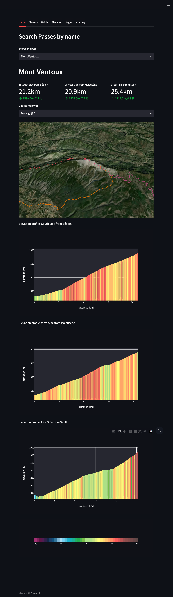
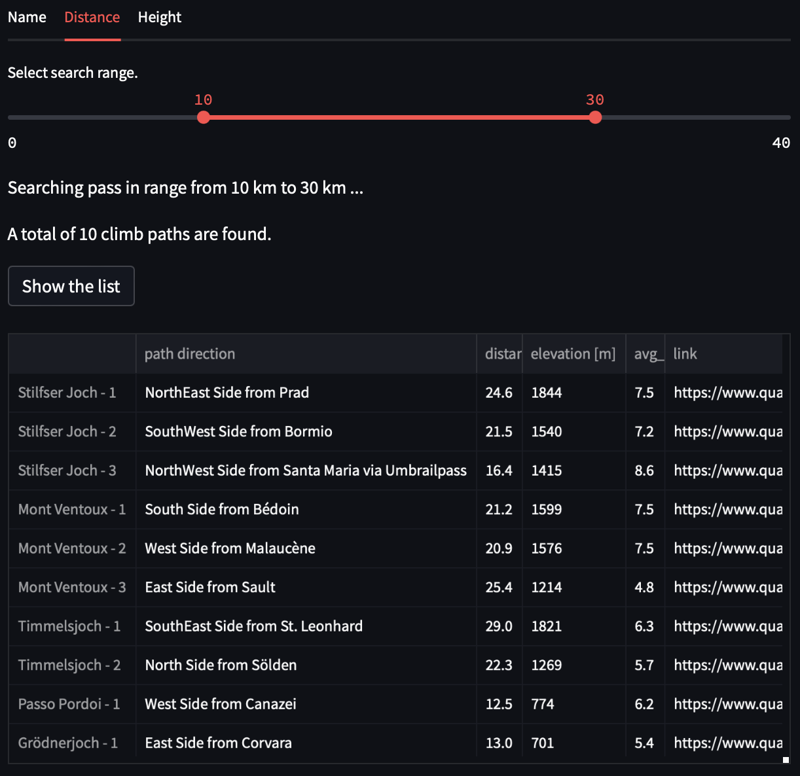

# PYPASS: Python wrapper for [quaeldich.de](https://www.quaeldich.de)

A Python interface to access data in [quaeldich.de](https://www.quaeldich.de).

[](https://pypass.streamlitapp.com)

Quaeldich.de owns all rights to the data. I am therefore willing to give up the repository upon request from quaeldich.de.

## Installation

Install from source:
We use `poetry` to manage all dependencies.
- `git clone git@github.com:kyoungseoun-chung/pypass.git`
- `poetry install`

## How it works

[Quaeldich.de](https://www.quaeldich.de) stores all mountain pass data in json files with unique data-ids. For example, **Mont Ventoux** approaching from **Bédoin** has geopositioning data (latitude, longitude, elevation, and distance) identified by `data-id=127_189`. Therefore, data can be accessed via the URL `https://www.quaeldich.de/qdtp/anfahrten/127_189.json`. We scraped all pass data URLs from the website and saved them in `pypass/db/passes.json`. Whenever you attempt to search for pass information, the code will first look for the URL and process data for you.


## Basic usage

Below shows basic search options you can use with `pypass`.

```python
>>> from pypass.passees import PassDB
>>> passdb = PassDB()
>>> passdb.search("Mont Ventoux", "name")
# List of a Pass with length == 1
[Pass(name="Mont Ventoux", coord=[44.1736, 5.27879], ...)]
>>> passdb.search("alpen", "region") # Only works for german names
# List of Passes matching criteria
[Pass(name="Stilfser Joch", ...), Pass(...), ...]
# Below commands returns similar return type shown above
>>> passdb.search("italien", "country") # Only works for german name
>>> passdb.search([1800, 2000], "height")
>>> passdb.search([10.0, 15.0], "distance")
>>> passdb.search([500, 1000], "elevation")
```

## Features

### Extract data

- You can use cli command to extract data from quaeldich.de.
    - You need two arguments `-e` and `-d`.
    - If you set give 0 for `-e`, it will extract all data registered in quaeldich.de.
    - If you don't set `-d` option, it will save db to `pypass/db/`.
    - DB doesn't contain geopositioning data. Only relevant URLs to be processed later on.

- Mac OS or Linux
    ```zsh
    python -m pypass -e NUMBER_OF_PASS_TO_BE_EXTRACTED -d DIRECTORY_TO_BE_SAVE_DB
    ```
- Windows
    ```zsh
    py -m pypass -e NUMBER_OF_PASS_TO_BE_EXTRACTED -d DIRECTORY_TO_BE_SAVE_DB
    ```

### DB structure

`pypass` has two different DBs.
- `pypass/db/passes.json`: DB contains all scraped Pass data from quaeldic.de. And the DB looks like:
```json
// pypass/db/passes.json
{
    "_default":
    {
        "1":
        {
            "name": ..., // name of Pass
            "coord": ..., // coordinate of the summit
            "country": ...,
            "region": ...,
            "height": ...,
            "total_distance": ..., // distances of all paths to the summit
            "total_elevation": ..., // elevation gain of all paths to the summit
            "avg_grad": ..., // average gradient of each paths
            "max_distance": ...,
            "min_distance": ...,
            "max_elevation": ...,
            "min_elevation": ...,
            "url": ..., // Pass url at quaeldich.de
            "gpts": ..., // geopositioning data. No actual data, only links.
            "status": ..., // HTTP reponse code. Always 200.
        },
        ...
    }
}
```
- `pypass/db/pass_names.json`: DB only contains all Pass names, regions, and country. If Pass has alternative name, it also stored as `alt`.


### Search and access Pass data

- You can search Pass data by region, name, height, distance, and elevation gain.

- Each `Pass` class contains all paths to the top including information regarding distance, elevation, and gradient.
```python
>>> from pypass.passees import PassDB
>>> passdb = PassDB()
>>> Pass = passdb.search("Mont Ventoux", "name")  # Always return list[Pass]
>>> Pass[0].path_names
['South Side from Bédoin', 'West Side from Malaucène', 'East Side from Sault']
# Mont Ventoux has 3 access points.
>>> Pass[0].total_distance
[21169.514785722, 20846.819408688, 25365.999999999996]  # in meter
>>> Pass[0].total_elevation
[1592.295991259, 1572.2721899565, 1152.0] # in meter
>>> Pass[0].avg_grad
[7.521646137742093, 7.5420243209918585, 4.54151226050619] # in %
>>> Pass[0].elevation
[array([ 313, ..., 1905.29599126]), ...]
# GPT log data for the elevation in meter (from start to end)
```

- Name suggestion for a typo when searching the pass.
```python
>>> from pypass.passees import PassDB
>>> passdb = PassDB()
>>> Pass = passdb.search("Mont Venoux", "name") # Wrong input name
...
NameError: The given name (Mont Ventox) is not in our database. Did you mean ['Mont Ventoux']?
# Raise `NameError` and will give name suggestion for the close match.
```


### Running GUI

We created GUI using [steamlit](https://streamlit.io).

- You can run GUI by typing following command in the file directory (git cloned directory):

```zsh
python -m streamlit run pypass/app.py
```

- Or you can simply run

```zsh
python -m pypass --gui # -g also works
```

It is possible to access via [URL](https://pypass.streamlitapp.com)

#### Demos:

* Search by name:
    - Pass can be searched by its name (supports drop-down menu).
    - Visual representation of paths in 2D (Folium) and 3D (Deck.gl) map.
    - Plots for the gradient profiles.



* Search by distance/elevation/height:
    - Passes are searched from the given range (using slider).
    - If a number of searched data is larger than 10, display statistics (histogram).
    - List of all searched data.



* Search by region/country:
    - Passes are searched from the given region/country.
    - Only works with German. However, you can search with drop-down menu.


### Current issues/WIPs

Below is the list of issues or WIPs.

#### DBs
- [ ] Function to update DB data efficiently.

#### GUI
- [ ] Sorting table properly.

#### MISC
- [ ] Proper translation (German - English).
- [ ] Fix all broken Pass names.
- [ ] Make proper test files
